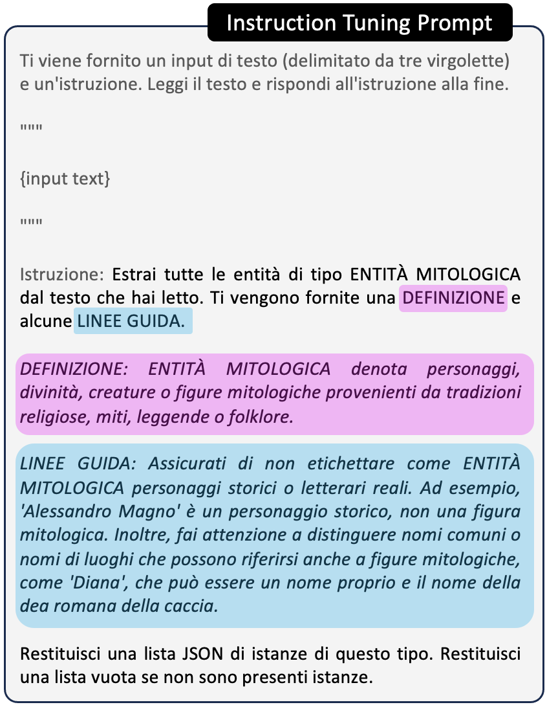
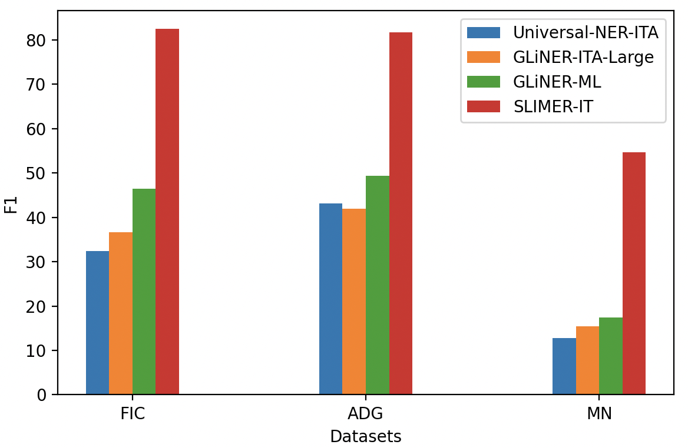

<div align="center">
  <h1>👻 SLIMER-IT 🇮🇹 Zero-Shot NER on Italian</h1>
</div>


<p align="center">
    <a href="https://github.com/andrewzamai/SLIMER_IT/blob/master/LICENSE"></a>
    <a href="https://huggingface.co/collections/expertai/slimer-it-6697d46fe5db76097c7ffa99"></a>
    <a href="https://arxiv.org/abs/2409.15933"></a>
    <a href="https://www.expert.ai/"></a>
</p>

## Instruct your LLM with Definitions and Guidelines for Zero-Shot NER 🔎 📖

SLIMER-IT is an Italian specialized version of SLIMER, an instruction-tuned LLM specifically designed to work on:

&nbsp;&nbsp;&nbsp;&nbsp;✅ Out-Of-Domain inputs (e.g. news, science, politics, music ...)

&nbsp;&nbsp;&nbsp;&nbsp;✅ Never-Seen-Before Named Entities (the model was not trained on that entity type? It will tag it anyway!)

<div align="center">

</div>


## 📄 TL;DR

Traditional methods approach NER as a token classification problem with narrow domain specialization and predefined label sets. Beyond requiring extensive human annotations for each task, they also face significant challenges in generalizing to out-of-distribution domains and unseen labels.

In contrast, Large Language Models (LLMs) have recently demonstrated strong zero-shot capabilities. Several models have been developed for zero-shot NER, including UniversalNER, GLiNER, GoLLIE, GNER, and SLIMER. Notably, SLIMER has proven particularly effective in handling unseen named entity types by leveraging definitions and guidelines to steer the model generation.

However, little has been done for zero-shot NER in non-English data. To this end, we propose an evaluation framework for Zero-Shot NER, and we apply it to the Italian language. 
In addition, we fine-tune a version of SLIMER for Italian, which we call SLIMER-IT. 
 
Despite being trained only on the PER, LOC, and ORG classes from the news-focused KIND dataset, SLIMER-IT not only outperforms models like GNER and GLiNER trained in similar settings but also surpasses existing off-the-shelf zero-shot NER models based on the GLiNER approach [1][2], which were fine-tuned on over 13,000 entities covering most known entity types.

Best performing SLIMER-IT 👻 implementation leverages on a LLaMA3 model fine-tuned specifically on Italian language 🇮🇹.

[1] https://huggingface.co/DeepMount00/universal_ner_ita

[2] https://huggingface.co/DeepMount00/GLiNER_ITA_LARGE


<div align="center">

</div>


PROs:

&nbsp;&nbsp;&nbsp;&nbsp;✅ guide your LLM with external knowledge about the NE to tag 
&nbsp;&nbsp;&nbsp;&nbsp;✅ definition and guidelines simple syntax (no code)

&nbsp;&nbsp;&nbsp;&nbsp;✅ flexibility to different annotation schemes 
&nbsp;&nbsp;&nbsp;&nbsp;✅ granularity and exceptions (all people not musicians)

&nbsp;&nbsp;&nbsp;&nbsp;✅ disambiguate on polysemous NEs
&nbsp;&nbsp;&nbsp;&nbsp;✅ nested-NER (one span of text, multiple categories)

&nbsp;&nbsp;&nbsp;&nbsp;✅ long documents handling

CONs:

&nbsp;&nbsp;&nbsp;&nbsp;❌ does not scale well with increasing label set cardinality (future work: prefix-caching)


## Installation

You will need to install the following dependencies to run SLIMER:
```
pip install --upgrade pip
pip install -r ./requirements.txt
```

## Running

Evaluate SLIMER-IT w/ D&G on KIND and Multinerd-IT datasets
```
# evaluate_vLLM.py <merged_model_name> <template_name> --with_guidelines
PYTHONPATH=$(pwd) python src/SFT_finetuning/evaluating/evaluate_vLLM.py expertai/LLaMAntino-3-SLIMER-IT llama3_italian --with_guidelines
```

Train, merge, evaluate your SLIMER:
```
# 1) train SLIMER-IT on KIND's WikiNews dataset with Definition and Guidelines, 3 NEs, all samples per NE
# finetune_sft.py <traininig_config_name> [--with_guidelines] <number_NEs> <number_pos_samples_per_NE> <number_neg_samples_per_NE>
PYTHONPATH=$(pwd) python src/SFT_finetuning/training/finetune_sft.py llama3_4_NER_XDef_NsamplesPerNE.yml --with_guidelines 3 -1 -1

# 2) merge LORA weights
PYTHONPATH=$(pwd) python src/SFT_finetuning/commons/merge_lora_weights.py <base_model_name> 3 -1 -1 --with_guidelines

# 3) evaluate SLIMER model
PYTHONPATH=$(pwd) python src/SFT_finetuning/evaluating/evaluate_vLLM.py <merged_model_name> <template_name> --with_guidelines
```

## Run it on your NER data!

Running SLIMER-IT on your data is simple as:

1) implement *load_datasetdict_BIO()* (tell where and how to load your NER data), *get_map_to_extended_NE_name()* (e.g. PER-->PERSON) of **Data_Interface** abstract class
   
2) provide your Definition and Guidelines for each NE class
   
3) run SLIMER-IT!

## Demo usage

A simple inference example is as follows:

```python
from vllm import LLM, SamplingParams
from src.SFT_finetuning.commons.prompter import Prompter as LLM_Prompter
from src.SLIMER_Prompter import SLIMER_Prompter as SLIMER_instruction_prompter

vllm_model = LLM("expertai/LLaMAntino-3-SLIMER-IT")
# it is recommended to use a temperature of 0
# max_new_tokens can be adjusted depending on the expected length and number of entities (default 128)
sampling_params = SamplingParams(temperature=0, max_tokens=128)

# suppose we want to extract the entities of type "algorithm", we just need to write the definition and guidelines in simple syntax
tag_to_extract = "ENTITÀ MITOLOGICA"
tag_definition = "ENTITÀ MITOLOGICA denota personaggi, divinità, creature o figure mitologiche provenienti da tradizioni religiose, miti, leggende o folklore."
tag_guidelines = "Assicurati di non etichettare come ENTITÀ MITOLOGICA personaggi storici o letterari reali. Ad esempio, 'Alessandro Magno' è un personaggio storico, non una figura mitologica. Inoltre, fai attenzione a distinguere nomi comuni o nomi di luoghi che possono riferirsi anche a figure mitologiche, come 'Diana', che può essere un nome proprio e il nome della dea romana della caccia. Assicurati di contestualizzare adeguatamente l'entità all'interno delle tradizioni mitologiche di riferimento."

# format the Def & Guidelines into SLIMER instruction
slimer_prompter = SLIMER_instruction_prompter("SLIMER_instruction_it", template_path='./src/templates')
instruction = slimer_prompter.generate_prompt(ne_tag=tag_to_extract, definition=tag_definition, guidelines=tag_guidelines)
print(instruction)
"Estrai tutte le entità di tipo ENTITÀ MITOLOGICA dal testo che hai letto. Ti vengono fornite una DEFINIZIONE e alcune LINEE GUIDA.
DEFINIZIONE: ENTITÀ MITOLOGICA denota personaggi, divinità, creature o figure mitologiche provenienti da tradizioni religiose, miti, leggende o folklore.
LINEE GUIDA: Assicurati di non etichettare come ENTITÀ MITOLOGICA personaggi storici o letterari reali. Ad esempio, 'Alessandro Magno' è un personaggio storico, non una figura mitologica. Inoltre, fai attenzione a distinguere nomi comuni o nomi di luoghi che possono riferirsi anche a figure mitologiche, come 'Diana', che può essere un nome proprio e il nome della dea romana della caccia. Assicurati di contestualizzare adeguatamente l'entità all'interno delle tradizioni mitologiche di riferimento.
Restituisci una lista JSON di istanze di questo tipo. Restituisci una lista vuota se non sono presenti istanze."

input_text = "Zeus, il re degli dèi dell'Olimpo, osservava mentre Poseidone agitava i mari e Atena, la dea della saggezza, pianificava la sua prossima mossa contro i Titani."

# prefix the input text to the instruction and format it into LLaMA-2 template 
llama3_prompter = LLM_Prompter('llama3_italian', template_path='./src/SFT_finetuning/templates', eos_text='')
prompts = [llama3_prompter.generate_prompt(instruction, input_text)]
print(json.dumps(prompts[0]))
"<|start_header_id|>system<|end_header_id|>\n\n Sei un utile assistente.<|eot_id|>\n<|start_header_id|>user<|end_header_id|>\n\nTi viene fornito un input di testo (delimitato da tre virgolette) e un'istruzione. \nLeggi il testo e rispondi all'istruzione alla fine.\n\"\"\"\nZeus, il re degli d\u00e8i dell'Olimpo, osservava mentre Poseidone agitava i mari e Atena, la dea della saggezza, pianificava la sua prossima mossa contro i Titani.\n\"\"\"\nIstruzione: Estrai tutte le entit\u00e0 di tipo ENTIT\u00c0 MITOLOGICA dal testo che hai letto. Ti vengono fornite una DEFINIZIONE e alcune LINEE GUIDA.\nDEFINIZIONE: ENTIT\u00c0 MITOLOGICA denota personaggi, divinit\u00e0, creature o figure mitologiche provenienti da tradizioni religiose, miti, leggende o folklore.\nLINEE GUIDA: Assicurati di non etichettare come ENTIT\u00c0 MITOLOGICA personaggi storici o letterari reali. Ad esempio, 'Alessandro Magno' \u00e8 un personaggio storico, non una figura mitologica. Inoltre, fai attenzione a distinguere nomi comuni o nomi di luoghi che possono riferirsi anche a figure mitologiche, come 'Diana', che pu\u00f2 essere un nome proprio e il nome della dea romana della caccia. Assicurati di contestualizzare adeguatamente l'entit\u00e0 all'interno delle tradizioni mitologiche di riferimento.\nRestituisci una lista JSON di istanze di questo tipo. Restituisci una lista vuota se non sono presenti istanze.<|eot_id|>\n<|start_header_id|>assistant<|end_header_id|>\n\n"

responses = vllm_model.generate(prompts, sampling_params)
all_pred_answers = [output.outputs[0].text.strip() for output in responses]
print(all_pred_answers[0])
"[\"Zeus\", \"Poseidone\", \"Atena\", \"Titani\"]"
```
    
## 📚 Citation

If you find SLIMER-IT useful in your work or research, please consider citing our paper:

```bibtex
@misc{zamai2024slimeritzeroshotneritalian,
      title={SLIMER-IT: Zero-Shot NER on Italian Language}, 
      author={Andrew Zamai and Leonardo Rigutini and Marco Maggini and Andrea Zugarini},
      year={2024},
      eprint={2409.15933},
      archivePrefix={arXiv},
      primaryClass={cs.CL},
      url={https://arxiv.org/abs/2409.15933}, 
}

```
